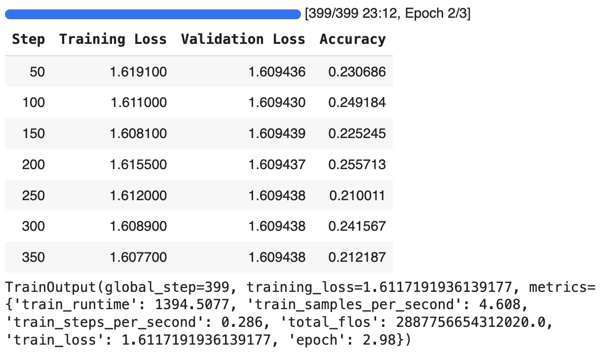
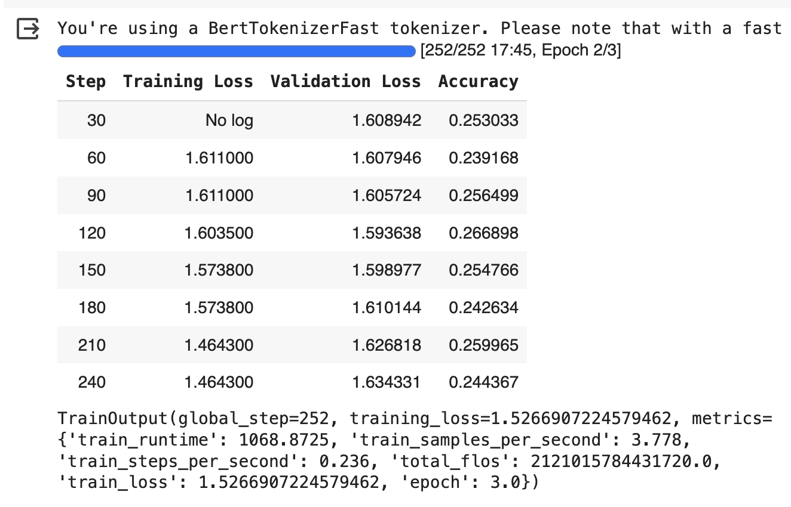

# Multiple choice question answering for the Ukrainian language

### Possible solution for multichoice QA:
1. Prompt engineering (output format too unstable, not accurate for Ukrainian).
2. Feed the whole question ending with “answer:”, then look at logits for letters А, Б, В, Г, Д (not accurate).
3. Calculate the perplexity of the question + each answer (not accurate).
4. Fine-tune:<br/>
https://huggingface.co/docs/transformers/tasks/multiple_choice
https://colab.research.google.com/drive/16HNLUrWuXs32XCh6FTOTZYUo4xNGII15?usp=sharing#scrollTo=O-m1RHrD9t1v

Data: [zno.train.jsonl](https://github.com/unlp-workshop/unlp-2024-shared-task/blob/b21cfa4e7d004e0d3129065c2ffe18b275690458/data/zno.train.jsonl)<br/>

Iterations:

1. Model: [google-bert/bert-base-multilingual-cased](https://huggingface.co/google-bert/bert-base-multilingual-cased)<br/>
Trained as is through AutoModelForMultipleChoice. Doesn't seem to be converging. Lowering the learning rate didn'd help.
```
BATCH_SIZE=2
gradient_accumulation_steps=8
learning_rate=5e-5
num_train_epochs=3
weight_decay=0.01
mixed data (history and language/literature)
```



2. Same model, split the data into subjects (only trained on language/literature questions). Started to slowly converge.

